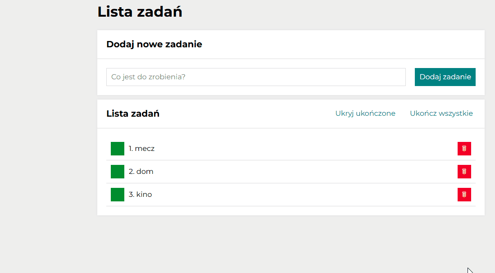

# Lista rzeczy do zrobienia

## Demo
https://annaczerwonka.github.io/ToDoList1/

## General Info
The todo-list application consists of two main elements:
1. A form with a field for entering tasks and a "Add Task" button.
2. A task list with the following options:
   - marking a task as completed, which crosses out its text (green button)
   - removing a task from the list (red button)
   - two additional buttons:
      - the first button hides or shows completed tasks
      - the second button marks all tasks as completed

these buttons follow these rules:
    - if the task list is empty, the buttons are not displayed
    - if all tasks are completed, the second button becomes disabled.     

## Technologies
- HTML
- CSS (media-queries, flexbox, grid)
- JavaScript ES6+ Features
- BEM
- Normalize
- Immutability 

